# OutSystems Developer Cloud (ODC) Custom Code Analyzer

 

 
 

> :information_source: This component is unofficial and unsupported by OutSystems.

⚡ _Screenshot showing the development of an ODC External Library in Visual Studio. The **ODC Custom Code Analyzer** flags several rule violations in the Problems panel. A related Quick Fix menu is open for one rule violation, offering to "Fix this type mapping" so the field correctly matches its `OSDataType.PhoneNumber`. You can get identical functionality in Visual Studio Code and Rider._  ⚡ 

## Overview

When you want to extend your ODC apps with custom C# code, you do so with the [External Libraries SDK](https://success.outsystems.com/documentation/outsystems_developer_cloud/building_apps/extend_your_apps_with_custom_code/external_libraries_sdk_readme/). This SDK allows you to write C# code that you can call from your ODC apps.

Although IntelliSense in your IDE guides the available SDK decorators and their syntax, it does not guide the rules you must follow (for example, on [naming](https://www.outsystems.com/tk/redirect?g=OS-ELG-MODL-05019) and [design decisions](https://www.outsystems.com/tk/redirect?g=OS-ELG-MODL-05018)). This guidance is provided when uploading your project's built assembly to the ODC Portal, where you get feedback on rule violations. **Using this component brings that feedback forward and gives you real-time feedback on compliance with the rules as you write the code. You also get real-time guidance on best practices and automatic fixes.**

### Technical Primer

When you upload your project's built assembly to the ODC Portal, it does not have access to the underlying code—the ODC Portal checks compliance with the rules by reflecting on the assembly's metadata.

This component, built from scratch, implements the rules using the rich code analysis APIs of [Roslyn](https://github.com/dotnet/roslyn), the .NET compiler.

```mermaid
graph TB
    subgraph User["👩‍💻 User"]
        code["Writes code"]:::userArea
    end

    subgraph Roslyn["🛠 Roslyn"]
        ast["Generates AST<br/>and semantic model"]:::roslyn
    end

    subgraph CustomCode_Analyzer["🔍 CustomCode-Analyzer"]
        analysis["Code analysis<br/>and fix provider"]:::analyzerArea
    end

    subgraph IDE["🖥 IDE"]
        display["Displays diagnosis and fixes"]:::ideArea
    end

    code --> ast
    ast --> analysis
    analysis --> display
    display --> code

    Roslyn -."using Roslyn APIs".-> CustomCode_Analyzer
```

#### Code analysis phases

The analyzer operates in two distinct phases, registered through the Roslyn [`AnalysisContext`](https://github.com/jonathanalgar/CustomCode-Analyzer/blob/33c0d5ce0a762236a495ebc940b688e9e14cd901/src/CustomCode-Analyzer/Analyzer.cs#L355-L364):

1. **Symbol analysis phase**  
   Triggered by [`RegisterSymbolAction`](https://github.com/jonathanalgar/CustomCode-Analyzer/blob/33c0d5ce0a762236a495ebc940b688e9e14cd901/src/CustomCode-Analyzer/Analyzer.cs#L383-L410), this phase performs immediate syntax and semantic analysis on individual declarations as you type. For example, when you declare a method, the analyzer instantly checks if its name starts with an underscore and reports a violation if it does (`NameBeginsWithUnderscoreRule`). These diagnostics appear immediately in your IDE's Problems window.

2. **Compilation end phase**  
   Registered via [`RegisterCompilationEndAction`](https://github.com/jonathanalgar/CustomCode-Analyzer/blob/33c0d5ce0a762236a495ebc940b688e9e14cd901/src/CustomCode-Analyzer/Analyzer.cs#L414-L417), this phase runs after all symbols have been processed and the semantic model is complete. For example, it ensures exactly one `[OSInterface]` exists across your project by maintaining a `ConcurrentDictionary` of interface declarations and validating their uniqueness (`NoSingleInterfaceRule` or `ManyInterfacesRule`). These diagnostics may appear with a slight delay as they require complete semantic analysis.

#### Code fixes for certain rules

Wherever we can infer a single, unambiguous fix, we provide an **automated code fix** through the Roslyn `CodeFixProvider`. Currently, code fixes are available for these rules:

| Rule description                 | OS-ELG-MODL code | Action performed                               |
|----------------------------------|------------------|------------------------------------------------|
| **Non-public OSInterface**       | 05004            | Make interface `public`                        |
| **Non-public OSStructure**       | 05010            | Make struct `public`                           |
| **Non-public OSStructureField**  | 05011            | Make property/field `public`                   |
| **Non-public OSIgnore**          | 05012            | Make `[OSIgnore]` property/field `public`      |
| **Missing structure decoration** | 05024            | Add `[OSStructure]` attribute to struct        |
| **Name begins with underscores** | 05022            | Remove leading `_` in method names             |
| **Unsupported type mapping**     | 05017            | Change field/property type to match `DataType` |

The code fix suggestions appear as "lightbulb" actions (or "quick actions") in your IDE. If you accept the fix, the analyzer modifies your source code to make it compliant with the respective rule.

## How to use

### Visual Studio 2022 (Enterprise, Pro and, Community editions)

You can use the auto-updating extension from the Visual Studio Marketplace. Simply [install the extension from the Visual Studio Marketplace](https://marketplace.visualstudio.com/items?itemName=JonathanAlgar.CustomCodeAnalyzer).

> :bulb: Want your extension to stay up to date? Enable auto-updates in Visual Studio: Go to **Tools** > **Options** > **Environment** > **Extensions** and check **Automatically update extensions**.

If your project references the External Libraries SDK (`OutSystems.ExternalLibraries.SDK`), the extension should automatically start providing feedback on your code. 

To ensure real-time feedback for [compilation end phase](#analyzer-phases) rules (and not just at the point of build), you need to configure your Visual Studio's background analysis:

1. Select **Tools** > **Options**. 
1. From the left menu select **C#** > **Advanced**. 
1. Set both **Run background code analysis** for and **Show compiler errors and warnings** to **Entire solution**.
1. Make sure the **Run code analysis in separate process box** is unchecked. 

### Others

Add the [NuGet package](https://www.nuget.org/packages/CustomCode.Analyzer/) as a dev dependency to your ODC external libraries project:

    dotnet add package CustomCode.Analyzer

If your project references the External Libraries SDK (`OutSystems.ExternalLibraries.SDK`), the package should automatically start providing feedback on your code.

The NuGet package cannot be automatically updated—be sure to update regularly to get the latest features.

#### Visual Studio Code

To ensure real-time feedback for [compilation end phase](#analyzer-phases) rules (and not just at the point of build), you need to configure your Visual Studio's background analysis:

1. Open the command palette (_Ctrl+Shift+P_).
1. Search for "roslyn". Set the **Dotnet › Background Analysis: Analyzer Diagnostics Scope** to **fullSolution**.

> :bug: For the [code fix](#code-fixes-for-certain-rules) to work, you need to be switch to using the pre-release version of the C# extension. See [this issue](https://github.com/dotnet/vscode-csharp/issues/7802).

## TODO

See [here](https://github.com/jonathanalgar/CustomCode-Analyzer/issues?q=is%3Aopen+is%3Aissue+label%3Aenhancement).

## Feedback and contributions

Please report bugs and feature requests [here](https://github.com/jonathanalgar/CustomCode-Analyzer/issues/new/choose). Feel free to leave general feedback on the [OutSystems Community Forum post](https://www.outsystems.com/forums/discussion/100963/odc-external-libraries-custom-code-analyzer/).

PRs are welcome. Code quality improvements, new features (especially those unassigned and listed [here](https://github.com/jonathanalgar/CustomCode-Analyzer/issues?q=is%3Aopen+is%3Aissue+label%3Aenhancement)), and documentation improvements are all welcome 🤗 All changes to Analyzer code should pass all existing tests (`dotnet test`), and all new features should  be covered by new tests. Please format any new code with [csharpier](https://csharpier.com/).