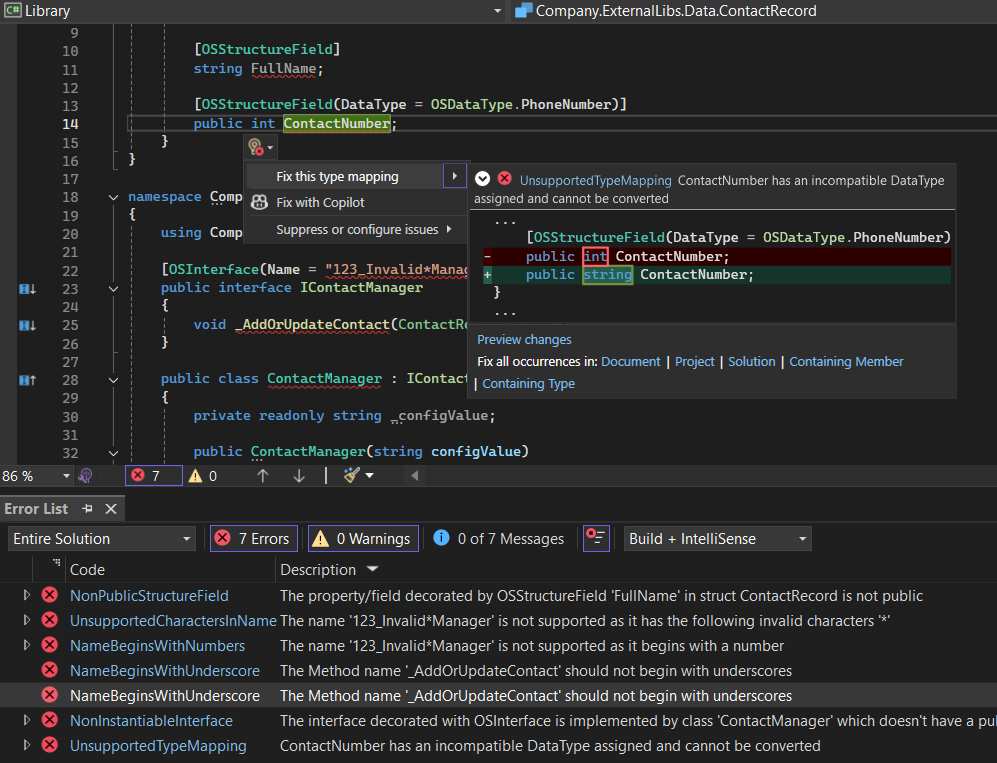

# OutSystems Developer Cloud (ODC) Custom Code Analyzer

[](https://sonarcloud.io/summary/new_code?id=jonathanalgar_CustomCode-Analyzer)
[](https://sonarcloud.io/summary/new_code?id=jonathanalgar_CustomCode-Analyzer) [](https://makeapullrequest.com)

[](https://sonarcloud.io/summary/new_code?id=jonathanalgar_CustomCode-Analyzer) [](https://sonarcloud.io/summary/new_code?id=jonathanalgar_CustomCode-Analyzer)
 [](https://sonarcloud.io/summary/new_code?id=jonathanalgar_CustomCode-Analyzer)

> :information_source: This component is unofficial and unsupported by OutSystems.



## Overview

When you want to extend your ODC apps with custom C# code, you do so with the [External Libraries SDK](https://success.outsystems.com/documentation/outsystems_developer_cloud/building_apps/extend_your_apps_with_custom_code/external_libraries_sdk_readme/). This SDK allows you to write C# code that you can call from your ODC apps.

Although IntelliSense in your IDE guides the available SDK decorators and their syntax, it does not guide the rules you must follow (for example, on [naming](https://www.outsystems.com/tk/redirect?g=OS-ELG-MODL-05019) and [design decisions](https://www.outsystems.com/tk/redirect?g=OS-ELG-MODL-05018)). This guidance is provided when uploading your project's built assembly to the ODC Portal, where you get feedback on rule violations. **Using this component brings that feedback forward and gives you real-time feedback on compliance with the rules as you write the code.**

### Technical Primer

When you upload your project's built assembly to the ODC Portal, it does not have access to the underlying code—the ODC Portal checks compliance with the rules using the assembly's metadata.

This component, built from scratch, implements the rules using the rich code analysis APIs of [Roslyn](https://github.com/dotnet/roslyn), the .NET compiler.

## How to use

### Visual Studio 2022 (Enterprise, Pro and Community editions)

You can use the auto-updating extension from the Visual Studio Marketplace. Simply [install the extension from the Visual Studio Marketplace](https://marketplace.visualstudio.com/items?itemName=JonathanAlgar.CustomCodeAnalyzer).

If your project references the External Libraries SDK (`OutSystems.ExternalLibraries.SDK`), the extension should automatically start providing feedback on your code.

### Others

Add the [NuGet package](https://www.nuget.org/packages/CustomCode.Analyzer/) as a dev dependency to your ODC external libraries project:

```dotnet add package CustomCode.Analyzer```

If your project references the External Libraries SDK (`OutSystems.ExternalLibraries.SDK`), the package should automatically start providing feedback on your code.

> :bulb: Auto-updating extensions for Visual Studio Code and Rider are in the works.

## TODO

- [ ] Marketplace extensions for Visual Studio Code and Rider.
- [ ] Beyond the rules: info-level guidance for [best practices](https://success.outsystems.com/documentation/outsystems_developer_cloud/building_apps/extend_your_apps_with_custom_code/external_libraries_sdk_readme/#best-practices) (statelessness checks, guidance on large binary files).
- [ ] Explore viability of implementing [OS-ELG-MODL-05009](https://www.outsystems.com/tk/redirect?g=OS-ELG-MODL-05009).
- [ ] Explore [`CodeFixProvider`](https://learn.microsoft.com/en-us/dotnet/api/microsoft.codeanalysis.codefixes.codefixprovider?view=roslyn-dotnet-4.9.0) for auto-fixable rules.

## Contributing

Please report bugs and feature requests [here](https://github.com/jonathanalgar/CustomCode-Analyzer/issues/new/choose).

PRs are welcome. Code quality improvements, features (especially those in the TODO list) and documentation improvements are all welcome 🤗 All changes to Analyzer code should pass all existing tests (`dotnet test`) and all new features should  be covered by new tests.